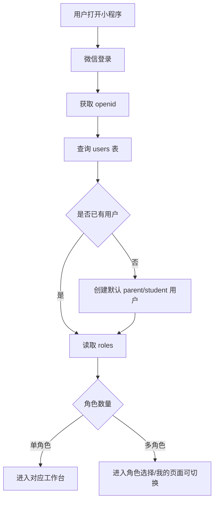
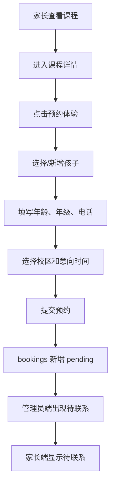
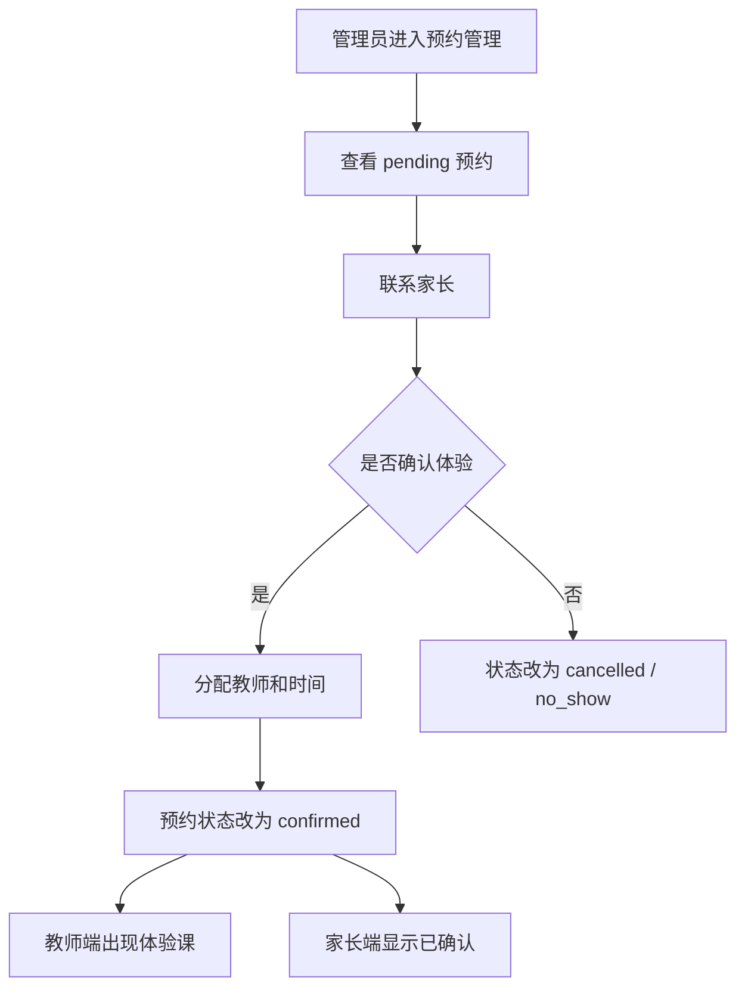
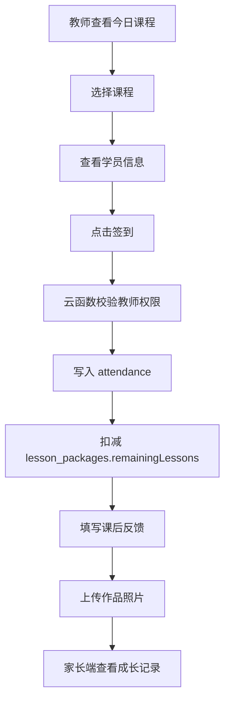
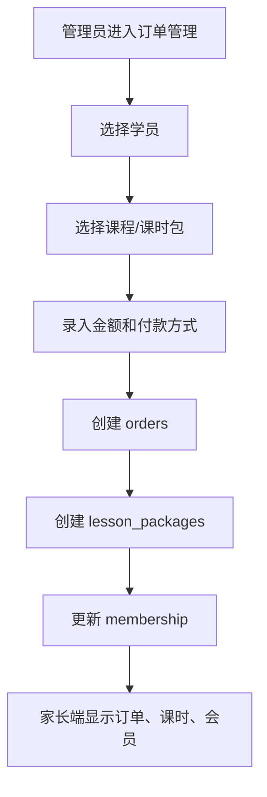
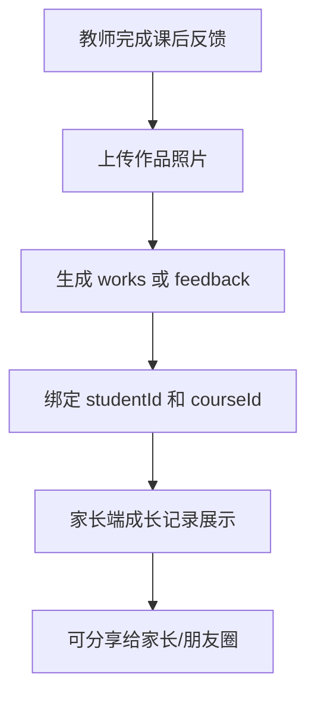

# MakerSeed 官网 + 微信小程序三端业务系统方案（Codex 分析版）

> 项目：MakerSeed / 种子创客工坊  
> 目标读者：Codex / Claude Code / Design / 开发者  
> 版本：v1.0  
> 日期：2026-06-16  
> 核心结论：官网负责展示与获客，小程序负责真实业务运营；小程序应按「学员/家长端、教师端、管理员端」三端业务系统设计。
> 2026-06-18 执行校准：视觉、学生端底部 Tab、页面结构以 `design/` 为当前真相源。本文中早期关于 TabBar 的备选或“不建议 MakerSeed”的分析，已被 `design/DESIGN_HANDOFF.md` 覆盖。

---

## 0. 文档目的

这份文档用于指导后续代码分析、重构、设计规划和功能开发。  
Codex 在分析或修改项目时，应以本文档作为业务与技术边界参考。

本文档覆盖：

1. 项目定位
2. 推荐仓库结构
3. 官网职责
4. 小程序三端架构
5. 页面与组件规划
6. 数据模型
7. 云函数 / API 规划
8. 权限模型
9. 核心业务流程
10. 部署方案
11. MVP 开发路线
12. Codex 实施建议与注意事项

---

## 1. 总体定位

MakerSeed 不应被设计为「官网 + 展示型小程序」，而应设计为：

```text
官网：
  展示工坊、品牌理念、课程方向、工坊空间、师资、成果、联系方式
  核心目标是建立信任、承接搜索、引导进入小程序

微信小程序：
  MakerSeed 的业务系统
  承担课程介绍、预约体验课、学员管理、教师上课、订单、会员、课时、成长记录等功能

后端 / 微信云开发：
  保存真实业务数据
  管理用户权限
  处理预约、订单、课时、会员、签到、通知、统计等业务逻辑
```

一句话分工：

```text
官网解决「展示与获客」
小程序解决「转化与运营」
后端解决「数据与权限」
```

---

## 2. 当前项目问题与重构方向

### 2.1 当前结构适合早期试验，但不适合长期业务化

当前项目已经有官网和小程序，但从长期业务角度看，需要进行结构化整理：

```text
当前问题：
  1. 官网文件位于根目录，容易与小程序、脚本、素材混在一起
  2. GitHub Pages 如果部署整个仓库，会把非官网文件一起发布
  3. 官网和小程序存在课程、品牌、地址等内容重复维护
  4. 小程序目前更像学员/家长端，教师端和管理员端不足
  5. 预约、学员、订单、会员等业务数据不能长期放本地缓存
  6. 图片、设计源文件、运行时素材需要分离
```

### 2.2 推荐重构方向

采用一个仓库，但拆成清晰的轻量 monorepo：

```text
makerseed_web/
  website/              # 官网展示端
  miniprogram/          # 微信小程序业务端
  cloud/                # 微信云开发：云函数、数据库规则、初始化数据
  content/              # 官网和小程序共用内容
  scripts/              # 校验、同步、部署辅助脚本
  docs/                 # 架构、数据模型、部署、权限说明
  design/               # 设计源文件，不参与官网发布
  .github/              # GitHub Actions
  README.md
  .gitignore
```

---

## 3. 推荐目标目录结构

### 3.1 总目录

```text
makerseed_web/
  website/
    index.html
    styles.css
    app.js
    config.example.js
    assets/
      brand/
      photos/
      qrcode/

  miniprogram/
    app.js
    app.json
    app.wxss
    project.config.json
    sitemap.json

    pages/
      role-select/

      student/
        home/
        courses/
        course-detail/
        booking/
        profile/
        orders/
        membership/
        works/

      teacher/
        home/
        schedule/
        checkin/
        students/
        feedback/
        profile/

      admin/
        dashboard/
        courses/
        teachers/
        students/
        bookings/
        orders/
        memberships/
        campuses/
        settings/
        profile/

    components/
      ms-button/
      ms-card/
      course-card/
      booking-card/
      student-card/
      teacher-card/
      order-card/
      member-card/
      status-tag/
      progress-card/
      empty-state/
      role-switcher/

    services/
      auth.service.js
      user.service.js
      course.service.js
      booking.service.js
      student.service.js
      teacher.service.js
      order.service.js
      member.service.js
      campus.service.js
      stats.service.js

    models/
      user.js
      student.js
      teacher.js
      course.js
      booking.js
      order.js
      membership.js
      lesson-package.js

    data/
      site-config.js
      mock-courses.js
      mock-campuses.js

    utils/
      date.js
      format.js
      validators.js
      permissions.js
      route.js

    images/

  cloud/
    functions/
      login/
      checkRole/
      createBooking/
      listBookings/
      updateBookingStatus/
      createStudent/
      updateStudent/
      teacherCheckin/
      createFeedback/
      createOrder/
      updateOrderStatus/
      getMemberInfo/
      updateMembership/
      adminDashboard/

    database/
      schema.md
      indexes.md
      security-rules.md
      seed.json

  content/
    brand.json
    courses.json
    campus.json
    articles.json
    teachers.json
    honors.json

  scripts/
    validate.py
    sync-content.py
    preview-miniprogram.sh
    upload-miniprogram.sh
    optimize-images.js

  docs/
    architecture.md
    data-model.md
    roles.md
    deployment.md
    roadmap.md

  design/
    brand-source/
      psd/
      ai/
      zip/
```

### 3.2 目录职责

```text
website/
  只放官网生产代码和官网运行素材

miniprogram/
  只放微信小程序前端代码

cloud/
  放微信云开发云函数、数据库规则、索引、初始化数据

content/
  放官网和小程序共用的品牌、课程、校区、教师、荣誉等静态内容源

scripts/
  放自动校验、内容同步、图片优化、小程序预览/上传脚本

docs/
  放业务规则、部署规则、数据模型、角色权限、路线图

design/
  放设计源文件，不参与官网发布，不进入小程序包
```

---

## 4. 官网方案

### 4.1 官网定位

官网是「展示与获客入口」，不承担复杂业务。

官网主要解决：

```text
1. 家长第一次认识 MakerSeed
2. 展示工坊真实环境
3. 展示课程方向和教育理念
4. 展示师资、资质、荣誉、成果
5. 建立信任
6. 引导扫码进入小程序
7. 提供联系方式和地址
```

官网不建议承担：

```text
1. 学员管理
2. 订单管理
3. 会员管理
4. 课时管理
5. 教师工作台
6. 复杂预约流程
7. 管理后台
```

### 4.2 官网页面模块

建议首页包含：

```text
Hero 首屏：
  品牌主张
  核心 CTA：预约体验 / 扫码进入小程序
  3 个核心信任点

课程方向：
  STEAM 项目课
  机器人与自动控制
  数字制造
  编程与计算思维
  FPV / RC / 格斗机器人
  科创活动 / 营地

机构信任：
  资质
  授牌
  教师
  学生作品
  比赛成果

工坊环境：
  空间照片
  工具设备
  项目现场

PBL / 作品案例：
  项目海报
  作品照片
  学生项目故事

预约体验：
  扫码进入小程序
  简单表单
  电话 / 微信 / 公众号

联系：
  地址
  电话
  公众号
  小程序码
```

### 4.3 官网部署

官网继续使用 GitHub Pages 或其他静态托管服务。

关键要求：

```yaml
# GitHub Pages artifact 只部署 website/
- name: Upload artifact
  uses: actions/upload-pages-artifact@v3
  with:
    path: "website"
```

不要部署整个仓库根目录。

---

## 5. 小程序总体架构

### 5.1 核心判断

小程序是 MakerSeed 的业务端，至少应包含三个端：

```text
1. 学员/家长端
2. 教师端
3. 管理员端
```

建议做成：

```text
一个小程序
  三套角色工作台
```

不建议第一阶段拆成三个独立小程序。

### 5.2 角色进入流程



### 5.3 角色定义

```text
student / parent:
  学员或家长使用
  负责查看课程、预约体验、查看订单、会员、课时、成长记录

teacher:
  教师使用
  负责查看课表、签到、课后反馈、学员跟进、作品记录

admin:
  管理员使用
  负责预约管理、学员管理、教师管理、课程管理、订单、会员、课时、统计

super_admin:
  超级管理员
  负责权限、系统配置、敏感操作、审计日志
```

产品上可以叫「学员端」，但数据模型里应区分：

```text
parent 家长
student 学员
```

因为实际预约、付款、订单、沟通多数由家长完成。

---

## 6. 三端页面规划

## 6.1 学员/家长端

### 6.1.1 定位

学员/家长端解决：

```text
了解课程
预约体验
查看报名和课程
查看订单和会员
查看剩余课时
查看成长记录 / 作品档案
联系机构
```

### 6.1.2 当前执行 TabBar

当前执行严格采用 `design/` 方案：

```text
校区 / 报名 / MakerSeed / 课程 / 我的
```

说明：早期非 design TabBar 已废弃，不再作为实现依据。

### 6.1.3 页面清单

```text
student/home/
  首页
  展示欢迎语、推荐课程、预约入口、成长概览、校区信息

student/courses/
  课程列表
  按年龄、类型、主题筛选

student/course-detail/
  课程详情
  展示课程介绍、适合年龄、项目成果、材料、课时、预约入口

student/booking/
  预约体验课
  填写学生、年级、年龄、电话、意向课程、校区、时间

student/profile/
  我的
  用户资料、孩子资料、预约、订单、会员、联系客服

student/orders/
  我的订单
  查看订单状态、付款状态、课程包

student/membership/
  会员 / 创客成长
  等级、创客值、权益、剩余课时

student/works/
  成长记录 / 作品档案
  展示教师反馈、作品照片、项目记录
```

### 6.1.4 学员端核心能力

```text
1. 查看课程
2. 查看课程详情
3. 预约体验课
4. 添加/绑定孩子
5. 查看预约状态
6. 查看订单
7. 查看课时包
8. 查看会员等级
9. 查看成长记录
10. 联系机构
```

---

## 6.2 教师端

### 6.2.1 定位

教师端解决：

```text
今日上课
查看课表
学员签到
扣减课时
填写课后反馈
上传作品照片
跟进学员
调课 / 请假
查看个人统计
```

### 6.2.2 推荐 TabBar

```text
今日 / 课表 / 学员 / 反馈 / 我的
```

MVP 可简化为：

```text
今日 / 课表 / 学员 / 我的
```

### 6.2.3 页面清单

```text
teacher/home/
  今日课程
  显示今日课表、待签到、待反馈、体验课提醒

teacher/schedule/
  我的课表
  周视图 / 日视图
  显示正式课、体验课、调课

teacher/checkin/
  签到页面
  确认上课、扣课时、记录出勤

teacher/students/
  我的学员
  查看自己负责或上过课的学员

teacher/feedback/
  课后反馈
  填写课堂内容、能力评价、上传作品照片

teacher/profile/
  我的
  教师资料、课时统计、调课记录、角色切换
```

### 6.2.4 教师端核心能力

```text
1. 查看今日课程
2. 查看课程详情和学员信息
3. 进行签到
4. 触发课时扣减
5. 填写课后反馈
6. 上传作品照片
7. 查看学员成长记录
8. 查看个人课时统计
```

---

## 6.3 管理员端

### 6.3.1 定位

管理员端是经营后台，解决：

```text
预约跟进
学员管理
教师管理
课程管理
班级管理
订单管理
会员管理
课时包管理
校区管理
统计报表
系统配置
```

### 6.3.2 推荐 TabBar

MVP 推荐：

```text
看板 / 预约 / 学员 / 管理 / 我的
```

备选：

```text
工作台 / 预约 / 课程 / 学员 / 我的
```

### 6.3.3 页面清单

```text
admin/dashboard/
  管理看板
  今日预约、待联系、今日课程、订单金额、新增学员、续费提醒

admin/bookings/
  预约管理
  查看待联系、已确认、已到访、已转化、已取消预约

admin/students/
  学员管理
  新增、编辑、查看学员档案、课程、订单、课时、成长记录

admin/teachers/
  教师管理
  添加教师、设置角色、查看课表、查看课时统计

admin/courses/
  课程管理
  新增/编辑课程、上下架、排序、设置年龄段和课程标签

admin/orders/
  订单管理
  录入线下订单、查看订单状态、退款/取消、生成课时包

admin/memberships/
  会员管理
  查看会员等级、创客值、有效期、权益、续费提醒

admin/campuses/
  校区管理
  地址、电话、校区介绍、营业时间、地图信息

admin/settings/
  系统设置
  预约规则、取消规则、通知模板、角色权限

admin/profile/
  我的
  管理员资料、角色切换、退出、系统信息
```

### 6.3.4 管理员端核心能力

```text
1. 查看业务看板
2. 处理预约
3. 分配教师
4. 管理学员
5. 管理课程
6. 管理教师
7. 录入订单
8. 生成课时包
9. 管理会员
10. 查看统计
11. 设置权限和规则
```

---

## 7. 自定义 TabBar 策略

小程序三端有两种实现方式。

### 7.1 方案 A：统一 TabBar + 角色工作台

```text
统一 tabBar：
  首页 / 课程 / 我的
```

不同角色进入后，首页内容不同。

优点：

```text
1. 实现简单
2. 适合 MVP
3. 不容易踩微信小程序 tabBar 限制
```

缺点：

```text
1. 三端体验不够彻底
2. 教师端和管理员端入口可能较深
```

### 7.2 方案 B：自定义 TabBar + 每个角色独立 Tab

```text
学员端：
  校区 / 报名 / MakerSeed / 课程 / 我的

教师端：
  今日 / 课表 / 学员 / 反馈 / 我的

管理员端：
  看板 / 预约 / 学员 / 管理 / 我的
```

优点：

```text
1. 角色体验清晰
2. 更适合长期业务系统
3. 扩展性更好
```

缺点：

```text
1. 开发复杂度更高
2. 需要处理角色切换、路径、权限、tab 状态
```

### 7.3 推荐

```text
MVP：
  先用统一 tabBar + 角色工作台

正式业务阶段：
  升级为自定义 tabBar + 三端独立体验
```

Codex 实现时应优先保证目录和权限模型清晰，即使暂时不用自定义 tabBar，也要让页面按角色分目录。

---

## 8. 数据模型设计

建议使用微信云数据库。以下为核心集合。

---

## 8.1 users 用户表

```js
{
  _id: "user_id",
  openid: "wechat_openid",
  unionid: "wechat_unionid_optional",
  phone: "13800000000",
  name: "用户姓名",
  avatar: "cloud://...",
  roles: ["parent", "teacher", "admin"],
  defaultRole: "parent",
  status: "active", // active | disabled
  createdAt: Date,
  updatedAt: Date
}
```

说明：

```text
1. 一个用户可以有多个角色
2. 默认新用户为 parent
3. 教师和管理员角色必须由管理员授权
4. 权限不能只靠前端隐藏按钮，必须在云函数校验
```

---

## 8.2 students 学员表

```js
{
  _id: "student_id",
  parentUserId: "user_id",
  name: "小明",
  gender: "male", // male | female | unknown
  birthday: "2016-06-01",
  grade: "小学三年级",
  school: "某某小学",
  interests: ["机器人", "编程", "数字制造"],
  level: "beginner",
  remark: "孩子喜欢动手，已有 Scratch 基础",
  status: "active", // active | inactive
  createdAt: Date,
  updatedAt: Date
}
```

说明：

```text
1. 家长和学员必须分开
2. 一个家长可以有多个孩子
3. 订单、课时包、成长记录应绑定 studentId
```

---

## 8.3 teachers 教师表

```js
{
  _id: "teacher_id",
  userId: "user_id",
  name: "李老师",
  phone: "13800000000",
  avatar: "cloud://...",
  bio: "创客教育教师",
  specialties: ["机器人", "数字制造", "编程"],
  status: "active", // active | inactive
  joinedAt: Date,
  createdAt: Date,
  updatedAt: Date
}
```

---

## 8.4 courses 课程表

```js
{
  _id: "course_id",
  title: "秋季 STEAM 项目课",
  category: "steam", // steam | coding | robot | maker | camp | event
  ageRange: "7-15 岁",
  summary: "项目制创客课程",
  description: "完整课程介绍",
  outcomes: ["完成项目作品", "掌握调试流程"],
  projects: ["机械小车", "传感器互动装置"],
  materials: ["结构件", "电子模块", "任务卡"],
  coverImage: "cloud://...",
  priceDisplay: "预约咨询",
  status: "published", // draft | published | archived
  sortOrder: 100,
  createdAt: Date,
  updatedAt: Date
}
```

---

## 8.5 campuses 校区表

```js
{
  _id: "campus_id",
  name: "种子创客工坊 江门校区",
  city: "江门市",
  address: "广东江门，详细地址请预约后确认",
  phone: "",
  location: {
    latitude: 0,
    longitude: 0
  },
  status: "active",
  createdAt: Date,
  updatedAt: Date
}
```

---

## 8.6 bookings 预约表

```js
{
  _id: "booking_id",
  studentId: "student_id",
  parentUserId: "user_id",
  courseId: "course_id",
  teacherId: "teacher_id_optional",
  campusId: "campus_id",
  date: "2026-07-01",
  timeSlot: "14:00-15:30",
  contactName: "家长姓名",
  contactPhone: "13800000000",
  status: "pending", // pending | contacted | confirmed | visited | converted | cancelled | no_show
  source: "miniprogram", // miniprogram | website | manual
  note: "想体验机器人课程",
  handledBy: "admin_user_id",
  createdAt: Date,
  updatedAt: Date
}
```

---

## 8.7 orders 订单表

```js
{
  _id: "order_id",
  studentId: "student_id",
  parentUserId: "user_id",
  courseId: "course_id",
  packageId: "lesson_package_id_optional",
  amount: 3000,
  paidAmount: 3000,
  paymentMethod: "offline", // offline | wechat_pay | transfer | cash
  paymentStatus: "paid", // unpaid | paid | refunded | cancelled
  orderStatus: "confirmed", // created | confirmed | completed | cancelled
  remark: "线下付款",
  createdBy: "admin_user_id",
  createdAt: Date,
  updatedAt: Date
}
```

---

## 8.8 lesson_packages 课时包表

```js
{
  _id: "lesson_package_id",
  studentId: "student_id",
  parentUserId: "user_id",
  orderId: "order_id",
  courseId: "course_id",
  totalLessons: 20,
  remainingLessons: 20,
  usedLessons: 0,
  expireAt: Date,
  status: "active", // active | expired | refunded | frozen
  createdAt: Date,
  updatedAt: Date
}
```

说明：

```text
1. 课时扣减必须通过云函数或后端事务执行
2. 不能让前端直接修改 remainingLessons
3. 课时包是订单、会员、签到之间的关键连接
```

---

## 8.9 memberships 会员表

```js
{
  _id: "membership_id",
  studentId: "student_id",
  parentUserId: "user_id",
  level: "新星级",
  status: "active", // active | expired | frozen
  startAt: Date,
  expireAt: Date,
  points: 0,
  growthValue: 0,
  benefits: ["成长档案", "优先活动报名"],
  createdAt: Date,
  updatedAt: Date
}
```

---

## 8.10 attendance 出勤表

```js
{
  _id: "attendance_id",
  studentId: "student_id",
  teacherId: "teacher_id",
  bookingId: "booking_id_optional",
  lessonPackageId: "lesson_package_id",
  courseId: "course_id",
  status: "checked_in", // checked_in | absent | leave | cancelled
  checkedInAt: Date,
  checkedInBy: "teacher_user_id",
  lessonDeducted: 1,
  createdAt: Date,
  updatedAt: Date
}
```

---

## 8.11 feedback 课后反馈表

```js
{
  _id: "feedback_id",
  studentId: "student_id",
  teacherId: "teacher_id",
  courseId: "course_id",
  attendanceId: "attendance_id",
  title: "机器人结构搭建与调试",
  content: "本节课完成了机械结构搭建，并尝试调试传感器。",
  abilityTags: ["结构设计", "问题调试", "团队协作"],
  images: ["cloud://..."],
  visibility: "parent", // parent | internal
  createdAt: Date,
  updatedAt: Date
}
```

---

## 8.12 works 作品档案表

```js
{
  _id: "work_id",
  studentId: "student_id",
  teacherId: "teacher_id",
  courseId: "course_id",
  title: "传感器互动装置",
  description: "通过超声波传感器控制灯光变化",
  images: ["cloud://..."],
  video: "cloud://...",
  tags: ["Arduino", "传感器", "创客作品"],
  createdAt: Date,
  updatedAt: Date
}
```

---

## 8.13 notifications 通知表

```js
{
  _id: "notification_id",
  userId: "user_id",
  type: "booking_confirmed", 
  title: "体验课预约已确认",
  content: "你的体验课已确认，请按时到访。",
  read: false,
  relatedId: "booking_id",
  createdAt: Date
}
```

---

## 8.14 audit_logs 审计日志

```js
{
  _id: "log_id",
  actorUserId: "admin_user_id",
  action: "update_order_status",
  targetType: "order",
  targetId: "order_id",
  before: {},
  after: {},
  createdAt: Date
}
```

敏感操作必须记录：

```text
1. 修改订单金额
2. 修改支付状态
3. 扣减 / 恢复课时
4. 修改会员状态
5. 修改角色权限
6. 删除或取消预约
```

---

## 9. 状态枚举

### 9.1 用户状态

```text
active
disabled
```

### 9.2 预约状态

```text
pending      待联系
contacted    已联系
confirmed    已确认
visited      已到访
converted    已转正式
cancelled    已取消
no_show      未到访
```

### 9.3 订单支付状态

```text
unpaid
paid
refunded
cancelled
```

### 9.4 订单业务状态

```text
created
confirmed
completed
cancelled
```

### 9.5 课时包状态

```text
active
expired
refunded
frozen
```

### 9.6 出勤状态

```text
checked_in
absent
leave
cancelled
```

### 9.7 课程状态

```text
draft
published
archived
```

---

## 10. 云函数 / API 规划

如果使用微信云开发，建议所有敏感业务通过云函数处理。

### 10.1 认证与角色

```text
login
  获取 openid
  查找或创建 users
  返回用户基本信息和 roles

checkRole
  校验用户是否拥有某角色

switchRole
  切换当前角色
```

### 10.2 学员

```text
createStudent
  家长新增孩子

updateStudent
  修改孩子资料

listMyStudents
  家长查看自己的孩子

adminListStudents
  管理员查看全部学员
```

### 10.3 课程

```text
listCourses
  学员端查看已发布课程

getCourseDetail
  查看课程详情

adminCreateCourse
  管理员创建课程

adminUpdateCourse
  管理员编辑课程

adminArchiveCourse
  管理员归档课程
```

### 10.4 预约

```text
createBooking
  家长创建体验课预约

listMyBookings
  家长查看自己的预约

adminListBookings
  管理员查看预约列表

updateBookingStatus
  管理员更新预约状态

assignBookingTeacher
  管理员分配教师
```

### 10.5 教师

```text
teacherTodaySchedule
  教师查看今日课程

teacherSchedule
  教师查看课表

teacherListStudents
  教师查看自己的学员

teacherCheckin
  教师签到并扣课时

createFeedback
  教师提交课后反馈

createWork
  教师上传作品记录
```

### 10.6 订单与课时

```text
adminCreateOrder
  管理员录入订单

adminUpdateOrderStatus
  管理员更新订单状态

createLessonPackage
  根据订单生成课时包

listMyOrders
  家长查看订单

listMyLessonPackages
  家长查看课时包

adminAdjustLessonPackage
  管理员调整课时包，必须记录 audit_logs
```

### 10.7 会员

```text
getMemberInfo
  获取会员信息

updateMembership
  管理员更新会员等级、有效期、权益

increaseGrowthValue
  增加创客值
```

### 10.8 管理看板

```text
adminDashboard
  今日预约
  待联系数
  今日课程
  新增学员
  本月订单
  续费提醒

statsOverview
  汇总统计

statsTeacher
  教师课时统计

statsStudent
  学员增长统计
```

---

## 11. 权限矩阵

| 功能 | 学员/家长 | 教师 | 管理员 | 超级管理员 |
|---|---:|---:|---:|---:|
| 浏览课程 | ✅ | ✅ | ✅ | ✅ |
| 预约体验课 | ✅ | ❌ | ✅ 代录 | ✅ |
| 查看自己的预约 | ✅ | ❌ | ✅ | ✅ |
| 查看全部预约 | ❌ | ❌ | ✅ | ✅ |
| 分配教师 | ❌ | ❌ | ✅ | ✅ |
| 查看自己的孩子 | ✅ | ❌ | ✅ | ✅ |
| 查看全部学员 | ❌ | 仅相关学员 | ✅ | ✅ |
| 查看教师课表 | ❌ | 自己 | ✅ | ✅ |
| 教师签到 | ❌ | ✅ 自己课程 | ✅ | ✅ |
| 扣减课时 | ❌ | 通过签到触发 | ✅ | ✅ |
| 填写课后反馈 | ❌ | ✅ | ✅ | ✅ |
| 查看成长记录 | ✅ 自己孩子 | ✅ 相关学员 | ✅ | ✅ |
| 创建订单 | ❌ | ❌ | ✅ | ✅ |
| 修改订单金额 | ❌ | ❌ | 受限 | ✅ |
| 修改会员 | ❌ | ❌ | ✅ | ✅ |
| 管理角色 | ❌ | ❌ | ❌ | ✅ |
| 查看审计日志 | ❌ | ❌ | ❌ | ✅ |

关键原则：

```text
1. 前端隐藏按钮只是体验优化
2. 云函数必须校验用户角色
3. 家长只能访问自己的孩子
4. 教师只能访问自己相关的课程和学员
5. 管理员能访问业务数据
6. 超级管理员才能修改权限和敏感配置
```

---

## 12. 核心业务流程

## 12.1 家长预约体验课



---

## 12.2 管理员处理预约



---

## 12.3 教师签到与课后反馈



注意：

```text
签到扣课时必须是后端事务或云函数原子逻辑
不能由前端直接修改课时
```

---

## 12.4 管理员录入订单与课时包



---

## 12.5 成长记录 / 作品档案



这是 MakerSeed 的关键差异化功能，应作为小程序核心模块之一。

---

## 13. 组件规划

建议 Codex 在小程序中优先抽象以下组件。

### 13.1 基础组件

```text
ms-button
ms-card
ms-section
ms-modal
ms-form-field
empty-state
status-tag
progress-card
role-switcher
```

### 13.2 业务组件

```text
course-card
booking-card
student-card
teacher-card
order-card
member-card
lesson-package-card
feedback-card
work-card
stats-card
```

### 13.3 组件原则

```text
1. 三端共用的组件放 components/
2. 角色独有组件可以放 pages/<role>/_components/ 或 components/<role>-xxx
3. 颜色、圆角、间距尽量使用全局 tokens
4. 不要在页面里重复写同类卡片
```

---

## 14. 样式与设计系统

### 14.1 品牌色建议

```text
品牌蓝：
  用于品牌识别、链接、导航、重点信息

行动橙：
  只用于关键操作，如预约、报名、提交、支付

成长金：
  用于会员等级、创客值、成就、奖励

课程紫：
  用于课程分类、项目标签、图形母题

暖白 / 浅灰：
  用于背景和卡片层次

黑色 / 深灰：
  用于标题、正文、信息结构
```

### 14.2 小程序视觉原则

```text
1. 浅灰背景 + 白色圆角卡片
2. 橙色按钮只给最重要动作
3. 状态标签统一颜色
4. 卡片可复用
5. 不要过度使用多彩色块
6. 页面层级要清楚
```

### 14.3 状态标签色彩建议

```text
pending      待联系      灰 / 黄
confirmed    已确认      蓝
visited      已到访      紫
converted    已转正式    绿
cancelled    已取消      灰
no_show      未到访      红 / 橙
paid         已支付      绿
unpaid       未支付      黄
expired      已过期      灰
```

---

## 15. 内容同步方案

### 15.1 共用内容源

建立：

```text
content/
  brand.json
  courses.json
  campus.json
  articles.json
  teachers.json
  honors.json
```

这些内容可以同步到官网和小程序。

### 15.2 同步目标

```text
content/brand.json
  -> website/data/brand.js
  -> miniprogram/data/site-config.js

content/courses.json
  -> website/data/courses.js
  -> miniprogram/data/courses.js

content/campus.json
  -> website/data/campus.js
  -> miniprogram/data/campus.js
```

### 15.3 不要重复维护

避免：

```text
官网一份课程数据
小程序一份课程数据
后台又一份课程数据
```

早期可以静态 JSON；正式业务阶段，课程主数据应进入云数据库，由管理员端维护。

---

## 16. 图片与素材规范

### 16.1 文件名规范

不要使用中文或转义文件名作为生产文件名。

推荐：

```text
logo.png
logo-white.png
logo-square.png
logo-wide-white.png
workshop-space.webp
teacher-liweilin.webp
course-robotics.webp
pbl-drone.webp
campus-jiangmen.webp
```

### 16.2 官网图片

```text
1. 使用 webp / avif
2. 生成多尺寸
3. 首屏图片重点压缩
4. 非首屏 lazy-load
5. 原图放 design/ 或云存储
```

### 16.3 小程序图片

```text
1. 小程序包内只放必要图标和少量静态图
2. 课程图、作品图、照片尽量放云存储 / CDN
3. 列表页用缩略图
4. 详情页按需加载高清图
```

---

## 17. 部署方案

## 17.1 官网部署

```text
部署方式：
  GitHub Pages / 静态托管 / 自有域名

部署目录：
  website/

不要部署：
  miniprogram/
  cloud/
  design/
  scripts/
```

## 17.2 小程序部署

小程序应优先走微信官方链路：

```text
本地开发
  ↓
微信开发者工具预览
  ↓
真机调试
  ↓
上传体验版
  ↓
体验成员测试
  ↓
提交审核
  ↓
审核通过后发布正式版
```

### 17.3 自动化策略

可以使用脚本或 CI 做：

```text
1. 运行 validate.py
2. 检查页面路径
3. 检查 tabBar 配置
4. 检查关键资源
5. 上传体验版
```

不建议自动发布正式版。正式发布应人工确认。

---

## 18. MVP 开发范围

### 18.1 MVP 目标

第一阶段不要一次做完整教务系统。MVP 目标是：

```text
1. 官网结构清晰
2. 小程序三端目录搭好
3. 学员端可看课程和预约
4. 管理员端可处理预约
5. 教师端可查看今日体验课
6. 数据进入云数据库
```

### 18.2 MVP 功能清单

#### 官网

```text
1. 首页
2. 课程展示
3. 工坊环境
4. 师资/资质/成果
5. 预约入口
6. 联系方式
```

#### 学员/家长端

```text
1. 首页
2. 课程列表
3. 课程详情
4. 预约体验课
5. 我的预约
6. 我的孩子
```

#### 教师端

```text
1. 教师首页
2. 今日课程
3. 查看学员
4. 签到占位 / 简化签到
```

#### 管理员端

```text
1. 管理看板
2. 预约列表
3. 更新预约状态
4. 分配教师
5. 学员列表
```

#### 云开发

```text
1. login
2. users
3. students
4. courses
5. bookings
6. createBooking
7. adminListBookings
8. updateBookingStatus
```

---

## 19. 开发路线图

### Phase 0：整理结构

```text
1. 创建 website/
2. 把官网文件迁移到 website/
3. 修改 GitHub Pages workflow，只部署 website/
4. 创建 content/
5. 创建 docs/
6. 整理 design/
```

### Phase 1：小程序三端骨架

```text
1. 创建 pages/student/
2. 创建 pages/teacher/
3. 创建 pages/admin/
4. 创建 role-select/
5. 创建 permissions.js
6. 创建 auth.service.js
7. 创建 role-switcher 组件
```

### Phase 2：学员端 MVP

```text
1. 首页
2. 课程列表
3. 课程详情
4. 预约体验
5. 我的预约
6. 我的孩子
```

### Phase 3：云开发接入

```text
1. 初始化云环境
2. users 集合
3. students 集合
4. courses 集合
5. bookings 集合
6. login 云函数
7. createBooking 云函数
8. listBookings 云函数
```

### Phase 4：管理员端 MVP

```text
1. 管理看板
2. 预约管理
3. 分配教师
4. 更新预约状态
5. 学员管理基础版
```

### Phase 5：教师端 MVP

```text
1. 教师首页
2. 今日课程
3. 查看学员
4. 签到
5. 课后反馈
```

### Phase 6：订单、课时、会员

```text
1. orders
2. lesson_packages
3. memberships
4. 管理员录入订单
5. 生成课时包
6. 家长查看剩余课时
7. 教师签到扣课时
```

### Phase 7：成长记录与作品档案

```text
1. feedback
2. works
3. 教师上传作品
4. 家长查看成长记录
5. 作品分享
```

### Phase 8：统计与运营

```text
1. 预约统计
2. 学员增长
3. 课时消耗
4. 教师课时
5. 订单收入
6. 续费提醒
```

---

## 20. Codex 实施原则

Codex 在分析或重构时应遵循以下原则。

### 20.1 不要破坏当前可运行状态

每次重构应保持：

```text
1. 官网能打开
2. 小程序能编译
3. app.json 页面路径正确
4. tabBar 页面存在
5. 样式不大面积崩坏
```

### 20.2 先搬目录，再改业务

推荐顺序：

```text
1. 先移动官网到 website/
2. 修改部署路径
3. 再重构 miniprogram 页面目录
4. 再抽 components/
5. 再抽 services/
6. 最后接云开发
```

### 20.3 不要直接使用设计稿 HTML 作为生产代码

如果有 `.dc.html` 或设计工具导出的 HTML，它只能作为视觉参考。

正式代码应拆成：

```text
website/
  index.html
  styles.css
  app.js

miniprogram/
  pages/
  components/
  services/
  data/
```

### 20.4 业务敏感操作必须后端处理

以下操作不能由前端直接写数据库：

```text
1. 修改订单金额
2. 修改支付状态
3. 扣减课时
4. 恢复课时
5. 修改会员等级
6. 修改用户角色
7. 删除业务记录
```

### 20.5 所有角色访问必须校验

前端可隐藏按钮，但云函数必须校验：

```text
user.roles includes requiredRole
```

### 20.6 数据模型优先于页面细节

三端业务系统最难的是数据一致性，不是页面。

优先保证：

```text
1. 用户和角色清晰
2. 家长和学员分离
3. 预约状态可追踪
4. 订单和课时关联
5. 签到和扣课时一致
6. 成长记录可归档
```

---

## 21. Codex 可执行任务清单

### Task 1：整理官网目录

```text
目标：
  将根目录官网文件移动到 website/

验收：
  website/index.html 可打开
  GitHub Pages workflow path 改为 website
  根目录不再混放官网生产文件
```

### Task 2：创建三端页面目录

```text
目标：
  miniprogram/pages 按角色分目录

新增：
  pages/student/
  pages/teacher/
  pages/admin/
  pages/role-select/
```

### Task 3：抽取角色权限工具

```text
新增：
  miniprogram/utils/permissions.js

包含：
  hasRole(user, role)
  canAccessPage(user, pageRole)
  getDefaultRole(user)
```

### Task 4：建立 auth.service.js

```text
新增：
  miniprogram/services/auth.service.js

包含：
  login()
  getCurrentUser()
  getCurrentRole()
  switchRole(role)
  requireRole(role)
```

### Task 5：建立业务 services

```text
新增：
  course.service.js
  booking.service.js
  student.service.js
  teacher.service.js
  order.service.js
  member.service.js
```

### Task 6：建立基础组件

```text
新增：
  components/course-card/
  components/booking-card/
  components/student-card/
  components/status-tag/
  components/empty-state/
  components/role-switcher/
```

### Task 7：改造预约数据

```text
目标：
  从本地缓存逐步迁移到云数据库

第一步：
  保留 mock / 本地 fallback

第二步：
  createBooking 调用云函数

第三步：
  管理员端读取云数据库预约列表
```

### Task 8：建立 docs

```text
新增：
  docs/architecture.md
  docs/data-model.md
  docs/roles.md
  docs/deployment.md
```

---

## 22. 验收清单

### 22.1 结构验收

```text
[ ] website/ 存在
[ ] miniprogram/ 存在
[ ] cloud/ 存在或预留
[ ] content/ 存在
[ ] docs/ 存在
[ ] design/ 源文件不参与部署
[ ] GitHub Pages 只部署 website/
```

### 22.2 小程序验收

```text
[ ] pages/student/ 存在
[ ] pages/teacher/ 存在
[ ] pages/admin/ 存在
[ ] role-select 页面存在
[ ] app.json 页面路径正确
[ ] tabBar 页面路径正确
[ ] 普通用户不会看到管理员入口
[ ] 教师端和管理员端有权限判断
```

### 22.3 业务验收

```text
[ ] 家长可创建预约
[ ] 管理员可查看预约
[ ] 管理员可更新预约状态
[ ] 教师可查看分配给自己的体验课
[ ] 学员和家长数据分离
[ ] 订单、课时、会员模型已设计
[ ] 敏感操作不由前端直接执行
```

### 22.4 部署验收

```text
[ ] 官网能独立部署
[ ] 小程序能用微信开发者工具导入
[ ] 小程序能预览
[ ] 小程序能上传体验版
[ ] 私密配置不提交仓库
```

---

## 23. 风险与注意事项

### 23.1 不要过早做复杂系统

第一版不要一次做：

```text
完整排课系统
在线支付
复杂会员等级
复杂统计报表
自动排班
多校区复杂权限
```

先跑通：

```text
课程展示
预约
管理员跟进
教师签到
课时
成长记录
```

### 23.2 不要把管理员端做进普通 tabBar

普通家长不应看到：

```text
课程管理
学员管理
订单管理
教师管理
```

这些应通过角色权限进入管理员工作台。

### 23.3 不要用前端本地缓存承载正式业务

本地缓存只能用于：

```text
demo
草稿
临时 fallback
```

正式业务必须进云数据库。

### 23.4 不要把密钥写进前端

以下内容不能提交：

```text
AppSecret
云开发密钥
Webhook secret
支付密钥
CRM token
企业微信机器人 key
```

### 23.5 设计图是参考，不是代码

设计稿导出的 HTML 不应直接进生产项目。  
必须按小程序组件、页面、服务层重新实现。

---

## 24. 最终目标架构

```text
MakerSeed
  官网 website
    负责展示工坊、品牌、课程、成果、预约入口

  小程序 miniprogram
    学员/家长端
      看课程、预约、订单、会员、成长记录

    教师端
      看课表、签到、反馈、作品记录

    管理员端
      管预约、学员、教师、课程、订单、会员、统计

  云开发 cloud
    用户
    角色
    学员
    课程
    预约
    订单
    课时包
    会员
    出勤
    反馈
    作品
    通知
    审计日志
```

---

## 25. 给 Codex 的一句话指令

在后续分析和修改此项目时，请优先按以下目标执行：

```text
将 MakerSeed 从「官网 + 展示型小程序」升级为：
  website/ 官网展示端
  miniprogram/ 三端业务小程序
  cloud/ 微信云开发业务后端
  content/ 公共内容源
  docs/ 架构与业务规则

小程序必须围绕：
  学员/家长端
  教师端
  管理员端

并优先保证：
  角色权限清晰
  数据模型清晰
  预约流程可用
  后续订单、课时、会员可扩展
```

---

## 26. 建议下一步

最推荐的下一步不是继续加页面，而是先做结构化重构：

```text
1. 迁移官网到 website/
2. 新建 content/
3. 新建 docs/
4. 小程序 pages 按 student/ teacher/ admin/ 拆分
5. 建立角色和权限工具
6. 预约数据从本地缓存迁移到云数据库
7. 再补教师端和管理员端 MVP
```

完成这一步后，MakerSeed 项目才真正具备后续扩展为业务系统的基础。
